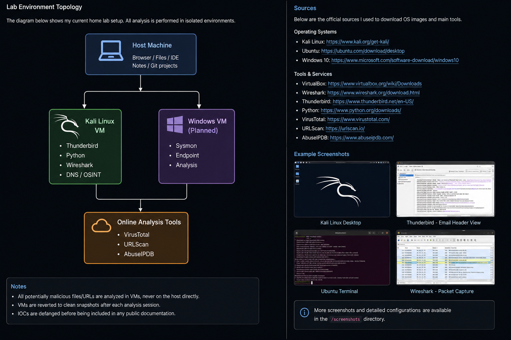
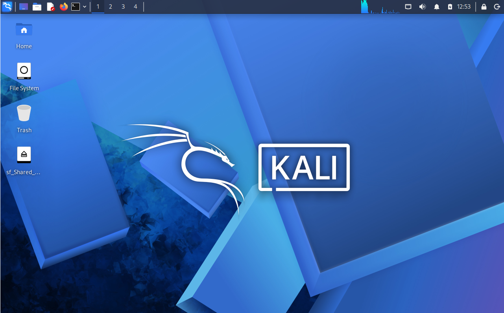
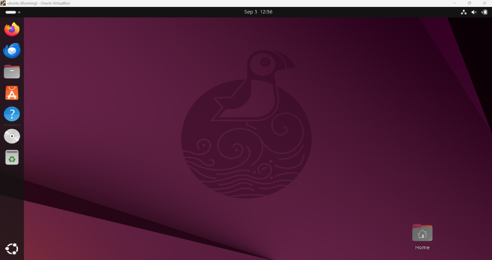
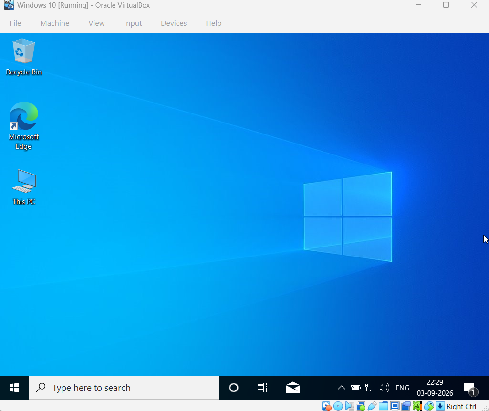

# Cybersecurity Home Lab

This directory documents my personal cybersecurity home lab, built to provide a controlled and reproducible environment for hands-on security learning and experimentation.

The lab is designed to support practical work across multiple areas of cybersecurity, including **security operations, vulnerability management, digital forensics, network analysis, security monitoring, and governance, risk, and compliance (GRC)**.

---

## Lab Objectives

The primary objectives of this lab are to:

* Practice cybersecurity concepts in a controlled environment
* Perform security investigations and analysis
* Analyze system and security logs
* Study vulnerabilities and security advisories
* Perform digital and email forensics exercises
* Develop familiarity with security monitoring tools
* Experiment with security configurations and controls
* Build and document reproducible cybersecurity projects

---

## Lab Environment

The lab is hosted on a personal computer using virtualization.

### Virtual Machines

| System         | Purpose                                                                  |
| -------------- | ------------------------------------------------------------------------ |
| **Kali Linux** | Security testing, network analysis, OSINT, forensics, and security tools |
| **Windows**    | Windows security analysis, endpoint investigation, and log analysis      |
| **Ubuntu**     | Security monitoring, Elastic Stack, log collection, and analysis         |

### Security Tools & Platforms

The lab and associated exercises make use of tools and platforms such as:

* Elastic Stack / Kibana
* Wireshark
* Autopsy
* Python
* Linux command-line tools
* VirusTotal
* URLScan
* AbuseIPDB
* Other security analysis and OSINT utilities as required by individual projects

---

## Lab Architecture

The environment uses virtualization to separate systems and allow security exercises to be conducted without directly affecting the host operating system.

**Host Machine → VirtualBox → Virtual Machines**

```text
                    Host Machine
                         │
                     VirtualBox
                         │
          ┌──────────────┼──────────────┐
          │              │              │
       Kali Linux      Windows        Ubuntu
          │              │              │
    Security Tools   Endpoint       Elastic /
    & Analysis       Analysis       Kibana
```

The virtual machines can be configured with isolated networking where appropriate to reduce unintended interaction with the host environment or external systems.

---

## Network Configuration

The lab uses virtualization networking to provide controlled connectivity.

Typical configurations include:

* **NAT** — Internet access for required updates and security tools
* **Host-Only Networking** — Controlled communication between the host and virtual machines

Network configuration may be adjusted depending on the requirements of individual security exercises.

---

## Lab Design Principles

The environment is designed around the following principles:

### Isolation

Security experiments are performed within virtualized systems to reduce risk to the host machine.

### Reproducibility

Configurations and important setup steps are documented so that experiments can be repeated.

### Practical Learning

The lab is primarily used for hands-on exercises rather than purely theoretical study.

### Documentation

Projects and investigations are documented with relevant evidence, methodology, findings, and conclusions.

### Expandability

The environment can be adapted as new cybersecurity areas, tools, and projects are explored.

---

## Documentation

The lab documentation includes:

* Network topology
* Virtual machine configuration
* Operating system setup
* Tool installation
* Relevant screenshots
* Configuration notes
* Project-specific lab requirements

### Lab Topology



### Virtual Machine Setup


### Kali Linux



### Ubuntu



### Windows



---

## Usage

This lab is used for authorized and controlled cybersecurity learning activities, including:

* Security monitoring
* Log analysis
* Vulnerability research
* Phishing and email analysis
* Digital forensics
* Network analysis
* Security assessment exercises
* Security awareness exercises
* GRC and security-control learning

All testing is performed within environments where I have authorization to conduct the activity.

---

## Future Development

The lab will evolve alongside my cybersecurity learning and may be expanded with:

* Additional security monitoring capabilities
* Endpoint telemetry and analysis
* More forensic investigation exercises
* Vulnerability assessment workflows
* Security-control testing
* GRC assessment exercises
* Security automation

---

## Repository Structure

```text
Lab-setup/
│
├── Readme.md
├── topology.png
│
└── screenshots/
    ├── virtualbox-lab.png
    ├── kali-linux.png
    ├── ubuntu.png
    └── windows10.png
```

---

**Purpose:** Personal cybersecurity learning, experimentation, and portfolio development.
